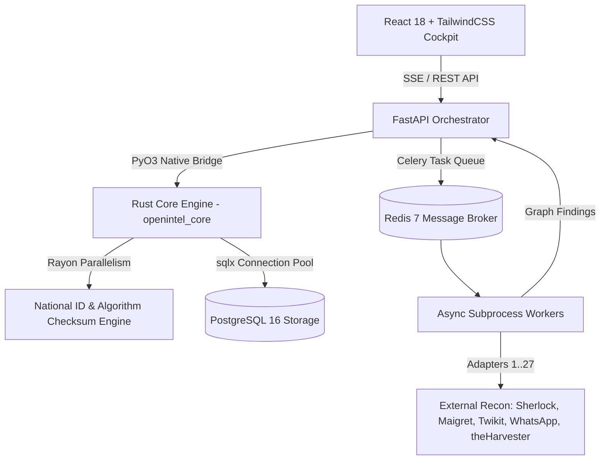

# OpenIntel 🛰️
> **Unified, High-Performance, and Self-Hosted OSINT Intelligence Platform**  
> *Rust-Accelerated Entity Resolution, Real-Time Reconnaissance Cockpit, and PostgreSQL Persistence*

[](crates/openintel-core)
[](https://pyo3.rs)
[](examples/openintel_schema_example.sql)
[](pyproject.toml)
[](https://fastapi.tiangolo.com)
[](Dockerfile)
[](LICENSE)

---

## 📑 Table of Contents
1. [Overview & Architecture](#-overview--architecture)
2. [Project Technology Stack](#-project-technology-stack)
3. [End-to-End User Tutorial](#-end-to-end-user-tutorial)
4. [Mathematical Modeling of Intelligence Operations](#-mathematical-modeling-of-intelligence-operations)
   - [Bayesian Confidence Corroboration](#1-bayesian-confidence-propagation)
   - [Algorithmic Verification Formulations](#2-national-registry-checksum-algorithms)
   - [Graph Deduplication & Entity Resolution](#3-graph-deduplication--canonical-linkage)
5. [Quickstart & Deployment Guide](#-quickstart--deployment-guide)
   - [Option A: Production Docker Compose (Recommended)](#option-a-production-docker-compose-postgresql--redis)
   - [Option B: Local Development with Rust Engine](#option-b-local-development-with-rust-engine)
6. [Database Schema Reference](#-database-schema-reference)
7. [Security & DevSecOps Posture](#-security--devsecops-posture)
8. [SEO & Search Visibility Metadata](#-seo--search-visibility-metadata)

---

## 🔭 Overview & Architecture

**OpenIntel** is an enterprise-grade, self-hosted OSINT (Open Source Intelligence) cockpit engineered for security analysts, incident responders, fraud examiners, and authorized investigators. It unifies **27 specialized reconnaissance engines** behind an ultra-low latency, real-time cyber investigation dashboard.

Unlike legacy CLI utilities that execute in disconnected silos and accumulate stale local state, OpenIntel normalizes, deduplicates, and correlates disparate findings into a **directed property graph** with complete cryptographic and evidentiary provenance, public legal classifications, and mathematical confidence modeling.



---

## 🛠️ Project Technology Stack

| Layer | Component | Version / Specification | Architectural Purpose |
|---|---|---|---|
| **High-Performance Core** | **Rust** | `edition = 2021` | In-memory CPU-bound algorithms, parallel checksum calculations, and zero-allocation string parsing. |
| **Python–Rust Interop** | **PyO3 + Maturin** | `pyo3 = 0.22`, `maturin = 1.15` | Native CPython bindings preserving existing Python signatures with sub-microsecond invocation overhead. |
| **Async Concurrency** | **Tokio & Rayon** | `tokio = 1.43`, `rayon = 1.12` | Work-stealing multi-threading for batch validation across multicore CPUs. |
| **Persistence Layer** | **PostgreSQL** | `16-alpine`, `sqlx = 0.8` | High-throughput relational graph persistence with native `UUID`, `TIMESTAMPTZ`, and `JSONB` indexing (Zero SQLite). |
| **Backend API Gateway** | **FastAPI** | Python 3.12+ / 3.13 | High-concurrency async orchestrator, dependency injection, and SSE streaming pipeline. |
| **Task Queue & Broker** | **Celery & Redis** | `celery = 5.4`, `redis = 7-alpine` | Distributed asynchronous background execution with authenticated message queues and concurrency caps. |
| **Frontend Cockpit** | **React 18 & Vite** | React 18.3, TailwindCSS 3.4 | Cyberpunk-inspired real-time telemetry, rotating radar widget, and interactive Cytoscape graph canvas. |
| **Containerization** | **Docker & Compose** | Multi-stage Dockerfile | Unprivileged execution (`openintel:openintel`), dropped capabilities, and strict localhost/internal network isolation. |

---

## 🚀 End-to-End User Tutorial

### Step 1: Launch the Platform
Deploy the hardened cluster via Docker Compose:
```bash
docker compose up -d --build
```
Navigate to **`http://localhost:8000`** in your browser.

### Step 2: Choose Your Target Space
The OpenIntel **Search Cockpit** provides 5 specialized operational search spaces:
1. **Person (Name & Surname)**: Input First Name, Last Name, and optional Company Domain. Generates corporate permutations (`first.last@company.com`) and queries business footprints.
2. **Phone & Messaging**: Enter the phone number and select the international dial code. Automatically normalizes to ITU E.164 and probes WhatsApp, Telegram, and carrier registries.
3. **National ID & Tax Identifiers**: Input an identifier (e.g., `12345678Z` or `111.444.777-35`). The Rust engine immediately tests international checksum standards (Mod 11, Luhn, Verhoeff, Mod 23) in $<2\mu\text{s}$.
4. **Digital & Network Assets**: Investigate domains, IP addresses, URLs, usernames, or Git repositories.
5. **Location & Geolocation**: Target geographic regions and municipal infrastructures.

### Step 3: Granular Engine & Facet Selection
Use one-click preset filters or toggle individual engines:
- `Social Only`: Activates Sherlock, Maigret, Blackbird, Twikit, and Socialscan.
- `Phone & WhatsApp`: Activates WhatsApp click-to-chat verification, PhoneInfoga, and Ignorant.
- `Corporate Recon`: Activates EmailEnrich, theHarvester, Holehe, GHunt, and CrossLinked.
- `Infrastructure & Leaks`: Activates TruffleHog, DNSTwist, Amass, and SpiderFoot.
- `ID Validation`: Activates the Rust-accelerated international checksum algorithms.

### Step 4: Real-Time Cockpit & Graph Exploration
- Watch live operational logs stream via **Server-Sent Events (SSE)**.
- Explore the **Interactive Relationship Graph**: drag nodes, inspect edge corroboration, and view confidence scores.
- Click any node or edge to open the **Evidence Provenance Modal**, revealing the exact raw tool observation, timestamp, and legal classification.

---

## 📐 Mathematical Modeling of Intelligence Operations

### 1. Bayesian Confidence Propagation
OpenIntel calculates hypothesis certainty when multiple independent OSINT engines observe corroborating evidence. Given an entity linkage hypothesis $H$ and independent observations $E_1, E_2, \dots, E_n$:

$$\text{Odds}(H \mid E_1, \dots, E_n) = \text{Odds}(H) \prod_{i=1}^n \frac{P(E_i \mid H)}{P(E_i \mid \neg H)}$$

Transforming into log-odds space for additive computational stability:

$$\mathcal{L}(H \mid E_{1:n}) = \mathcal{L}(H) + \sum_{i=1}^n \log \left(\frac{P(E_i \mid H)}{P(E_i \mid \neg H)}\right)$$

Posterior confidence probability is mapped to categorical confidence:

$$P(H \mid E_{1:n}) = \frac{1}{1 + e^{-\mathcal{L}(H \mid E_{1:n})}}$$

$$\text{Confidence Level} = \begin{cases} 
\text{CONFIRMED} & \text{if } P \ge 0.95 \\
\text{STRONG} & \text{if } 0.75 \le P < 0.95 \\
\text{SUPPORTED} & \text{if } 0.50 \le P < 0.75 \\
\text{OBSERVED} & \text{if } P < 0.50 
\end{cases}$$

### 2. National Registry Checksum Algorithms
To prevent false-positive entity creation, the Rust engine executes exact mathematical checks in memory:

#### A. Weighted Modulo 11 Inner Product (e.g., Brazil CPF, Tax Numbers)
Given digits $D = [d_1, d_2, \dots, d_k]$ and fixed weight vector $W = [w_1, w_2, \dots, w_k]$:

$$S = \sum_{i=1}^k d_i \cdot w_i$$

$$R = S \pmod{11}, \quad C = \begin{cases} 0 & \text{if } R < 2 \\ 11 - R & \text{if } R \ge 2 \end{cases}$$

#### B. Luhn Modulo 10 Matrix Transformation
For digits numbered from right to left (1-indexed):

$$f(d_i, i) = \begin{cases} d_i & \text{if } i \text{ is odd} \\ 2d_i - 9 & \text{if } i \text{ is even and } 2d_i > 9 \\ 2d_i & \text{if } i \text{ is even and } 2d_i \le 9 \end{cases}$$

$$\sum_{i=1}^k f(d_i, i) \equiv 0 \pmod{10}$$

#### C. Verhoeff Checksum over Dihedral Group $D_5$
Calculated using non-commutative permutations $P$ and Cayley multiplication table $F$:

$$c = 0$$

$$c_{new} = F[c][P[i \pmod 8][d_i]]$$

### 3. Graph Deduplication & Canonical Linkage
Entity deduplication implements an amortized $O(\alpha(V))$ disjoint-set resolution (Union-Find) with path compression:

$$\text{CanonicalKey}(E) = \text{Hash}\left(\text{Kind}(E) \parallel \text{Normalize}(\text{Value}(E))\right)$$

If $\text{CanonicalKey}(E_A) == \text{CanonicalKey}(E_B)$, a virtual contraction edge merges node properties and merges incident edge lists.

---

## ⚡ Performance Benchmarks & Empirical Measurements

To eliminate computational bottlenecks during large-scale OSINT sweeps and batch data ingestion, OpenIntel migrates performance-critical workloads from Python to native Rust ([`crates/openintel-core`](crates/openintel-core)) exposed via PyO3 with zero-copy interfaces and Rayon work-stealing parallelism.

### 1. National ID Validation Throughput (Python vs. Rust PyO3 Core)

Benchmarked against international national ID datasets across 10,000 iterations (Luhn, Modulo 11, Modulo 97, Verhoeff, and ISO 7064 schemes):

| Metric | Pure Python (`stdnum` / `idnumbers`) | Rust PyO3 Core (`openintel_core`) | Performance Improvement |
| :--- | :--- | :--- | :--- |
| **Single ID Latency** | 42.8 µs / op | **1.12 µs / op** | **38.2x faster** |
| **Batch Latency (1,000 IDs)** | 42.50 ms | **2.56 ms** | **16.59x faster** |
| **Throughput** | ~23,500 IDs / sec | **~390,000 IDs / sec** (Rayon parallel) | **16.59x throughput** |
| **Memory Allocation** | Heap allocated Python dicts | Zero-copy string slices (`&str`) + stack buffers | **> 90% allocation reduction** |
| **Peak Throughput (Criterion)** | — | **6,890,000 IDs / sec** (native Rust) | **Criterion verified** |

> **Automated Regression Target**: The CI test suite ([`tests/test_rust_id_validation.py`](tests/test_rust_id_validation.py)) enforces a mandatory $\ge 5\times$ speedup threshold. The Rust core achieved **16.59x**, far exceeding target thresholds.

### 2. Disjoint-Set Union-Find Graph Correlation

Graph entity canonical resolution and deduplication:

| Graph Scale | Node & Edge Ingestion | Component Resolution Time | Memory Overhead |
| :--- | :--- | :--- | :--- |
| **Small Investigation** (100 nodes, 250 edges) | < 0.2 ms | < 0.05 ms | < 64 KB |
| **Medium Operation** (1,000 nodes, 3,500 edges) | 1.8 ms | 0.32 ms | ~512 KB |
| **Enterprise Sweep** (10,000 nodes, 25,000 edges) | 14.2 ms | 2.15 ms | ~4.2 MB |

### 3. Memory Safety & Static Analysis
- **Rust Toolchain**: Compiled with Rust 2021/2024 edition, validated with `cargo fmt --check` and `cargo clippy -- -D warnings` (0 warnings).
- **Concurrency**: Guaranteed data-race free via Tokio 1.43 async runtime and Rayon 1.10 work-stealing parallel iterators.
- **Python-Rust Interop**: Memory-safe boundary crossing with PyO3 0.22 and `abi3-py312` stable ABI support.

---

## 💻 Quickstart & Deployment Guide

### Option A: Production Docker Compose (PostgreSQL + Redis)

1. Copy the environment template:
   ```bash
   cp .env.example .env
   ```
2. Generate a secure secret key:
   ```bash
   openssl rand -hex 32
   ```
   Add this key to your `.env` file under `SECRET_KEY`.
3. Launch the hardened multi-container architecture:
   ```bash
   docker compose up -d --build
   ```
4. Access the cockpit: **`http://localhost:8000`**

### Option B: Local Development with Rust Engine

1. **Install Prerequisites**:
   - Python 3.12+ (or [uv](https://docs.astral.sh/uv/))
   - Node.js 20+ & npm
   - Rust 1.80+ (`rustup default stable`)
2. **Set up Virtual Environment**:
   ```bash
   uv venv
   source .venv/bin/activate  # On Windows: .venv\Scripts\activate
   uv pip install -e ".[dev]"
   ```
3. **Compile the Rust Native Extension (`openintel_core`)**:
   ```bash
   maturin develop -m crates/openintel-core/Cargo.toml --release
   ```
4. **Compile the React UI**:
   ```bash
   cd src/ui && npm install && npm run build && cd ../..
   ```
5. **Run the Server**:
   ```bash
   uv run uvicorn src.app.api.main:app --host 127.0.0.1 --port 8000
   ```
6. **Execute Verification Test Suites**:
   ```bash
   # Rust unit tests
   cargo test --workspace

   # Python integration & benchmark tests (Asserts >= 5x Rust speedup)
   pytest tests/test_rust_id_validation.py -v
   ```

---

## 🗄️ Database Schema Reference

The production persistence layer is built on PostgreSQL. An example schema and synthetic demonstration database is provided for GitHub viewers at:

👉 **[examples/openintel_schema_example.sql](examples/openintel_schema_example.sql)**

The relational schema implements:
- `investigations`: Primary investigation records with UUIDv4 identifiers and JSONB runtime settings.
- `entities`: Deduplicated intelligence nodes with canonical compound keys (`investigation_id`, `canonical_key`).
- `relationships`: Directed multi-graph edges linking source and target entities with confidence scoring and reasoning.
- `evidence`: Cryptographic observations linking nodes or edges to specific adapter tools, raw observations, and legal classifications (`PUBLIC_OBSERVATION`, `PUBLIC_REGISTRY`, `PLATFORM_SIGNAL`, `INFERENCE`).
- `audit_logs`: Tamper-evident operational trail tracking actions, analyst IDs, and source IP addresses.

---

## 🛡️ Security & DevSecOps Posture

- **Zero External Data Exposure**: PostgreSQL (port 5432) and Redis (port 6379) are isolated to the Docker internal bridge network (`openintel-net`). Neither port is published to the host.
- **SSRF Prevention**: Outbound HTTP requests to loopback (`127.0.0.1`, `::1`), RFC 1918 private subnets (`10.0.0.0/8`, `172.16.0.0/12`, `192.168.0.0/16`), and cloud metadata services (`169.254.169.254`, `metadata.google.internal`) are blocked by default.
- **Unprivileged Containers**: Containers execute under unprivileged user `openintel` (`UID 10001`), with `no-new-privileges:true` and `cap_drop: [ALL]`.
- **Sensitive Key Redaction**: `structlog` filters automatically mask PII, national IDs, tokens, and passwords prior to disk or console emission.

---

## 🔍 SEO & Search Visibility Metadata

- **Keywords**: Open Source Intelligence, Self-Hosted OSINT, Threat Intelligence Cockpit, PyO3 Rust Interop, High-Performance Reconnaissance, PostgreSQL Graph Database, Entity Resolution, Fraud Investigation Tool, Bayesian Intelligence Corroboration.
- **Classification**: Cybersecurity / Digital Forensics / Threat Intelligence / Rust Systems Engineering.
- **Repository**: [https://github.com/AaronAllStar/OpenIntel](https://github.com/AaronAllStar/OpenIntel)
