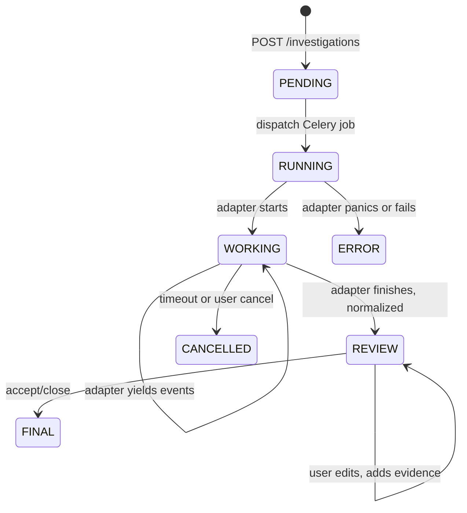

# OpenIntel — Architecture

## Purpose
Concrete decisions that implement the principles in AGENTS.md.
If AGENTS.md says *what* matters, this file says *how* it is built.

## Scope
Personal, single-user, self-hosted OSINT investigation app.
Runs on localhost or a personal VPS. Not multi-tenant. Not public-facing by default.

## Tech stack (locked)
- Backend: Python 3.12+, FastAPI, uvicorn
- Validation: Pydantic v2, pydantic-settings
- Database: PostgreSQL 16
- ORM: SQLAlchemy 2.x (sync) + Alembic for migrations
- Queue: Celery 5.x, Redis as broker + result backend
- Progress transport: Redis pub/sub → FastAPI SSE → React
- Frontend: React 18 (JavaScript, not TypeScript), Vite
- Animation: Framer Motion
- Graph: React Flow
- HTTP client (frontend): fetch + SWR or TanStack Query
- Packaging: uv (backend), npm (frontend)
- Lint / format: ruff + mypy (backend), ESLint + Prettier (frontend)
- Tests: pytest (+ pytest-asyncio for API routes), Vitest + Testing Library (frontend)

## Sync vs async model
This is the single most important architectural decision.

```text
FastAPI (async)         Celery worker (sync)
     │                        │
     │  dispatch task         │  run adapter
     ├───────────────────────►│  subprocess.run(...)
     │                        │  parse output
     │                        │  write to Postgres
     │                        │  publish progress to Redis
     │  SSE from Redis        │
     │◄───────────────────────┤
     │                        │
React ◄── SSE events ─────────┘
```

## Why sync adapters?
- Sherlock, Maigret, theHarvester, etc., are subprocess-based.
- Their non-blocking APIs are limited or non-existent.
- Running them in threads/async wrappers adds unnecessary complexity and risk.
- Celery worker is sync by design — no context-switching overhead.

## Why async FastAPI?
- Easy SSE for real-time progress updates.
- Good fit for Redis pub/sub.
- Standard pattern for API + job orchestration.

No RPC.
No WebSocket.
No GraphQL.

## Layers

```text
UI (React + Vite)
↓ HTTP + SSE
FastAPI
↓
Application services
↓
Domain (entities, ports, errors)
↓
Infrastructure (db, Redis, logging, health)
↓
Adapters
↓
External OSINT engines
```

## Layer responsibilities

- UI:
    - Display investigation progress.
    - SSE subscription to Redis for live events.
    - Render entities, relationships, evidence, graph.
    - Trigger investigations.

- FastAPI:
    - Authentication (none for personal app).
    - SSE endpoint for progress.
    - Investigation creation endpoint.
    - Investigation status + results retrieval.
    - Job dispatch.

- Application:
    - Orchestrates adapters.
    - Normalizes results into domain entities.
    - Computes simple relationships (same username across tools, etc.).
    - Maps adapter events → domain events.

- Domain:
    - Entities, value objects, ports, errors.
    - No SQL knowledge, no Redis knowledge.

- Infrastructure:
    - SQLAlchemy session + Alembic.
    - Redis client.
    - Logging configuration.
    - Health check endpoints.

## Adapters

Each adapter lives in:
```text
adapters/<engine>/
├── adapter.py
├── schemas.py            # per-engine Pydantic models
└── pyproject.toml        # only tool dependencies (sherlock, maigret, etc.)
```

Adapters:
- Never import from `app/domain` or `app/application`.
- Never touch the DB.
- Never call other adapters.
- Spawn subprocesses or threads to run tools.
- Yield adapter-specific events.

## Data flow

```
1. UI → POST /api/v1/investigations

2. FastAPI saves Investigation(PENDING) in DB, enqueues Celery task.

3. Celery worker:
   - Starts adapter.run(input)
   - Adapter spawns OSINT tool in subprocess
   - Adapter reads tool output, yields AdapterEvent stream
   - Worker writes to Postgres, publishes SSE events to Redis

4. UI subscribes to SSE from /api/v1/investigations/{id}/events
   - UI updates progress bar, timeline, evidence cards

5. After tool finishes, worker writes final state + entities/relationships to Postgres

6. UI polls /api/v1/investigations/{id}/summary or receives final event

7. UI renders graph, entities, evidence
```

No websockets. No RPC.
Pure HTTP + SSE.

## Investigation Lifecycle



## Backend organization

```
src/
  app/
    api/                # HTTP routes, FastAPI
    application/        # use cases, orchestrators, policies
    domain/             # entities, ports (Protocols), domain errors
    infrastructure/     # db, queue, logging, health checks
  adapters/
    sherlock/
    maigret/
    spiderfoot/
    photon/
    recon_ng/
    the_harvester/
    osint_executor.py   # central runner
  infra_container/    # Docker, docker-compose, entrypoints
  migrations/         # Alembic migrations
  schemas/            # Pydantic models (DTOs)
  ui/                 # Next.js or Vite frontend
  pyproject.toml
  Makefile            # dev commands
  ...etc
```